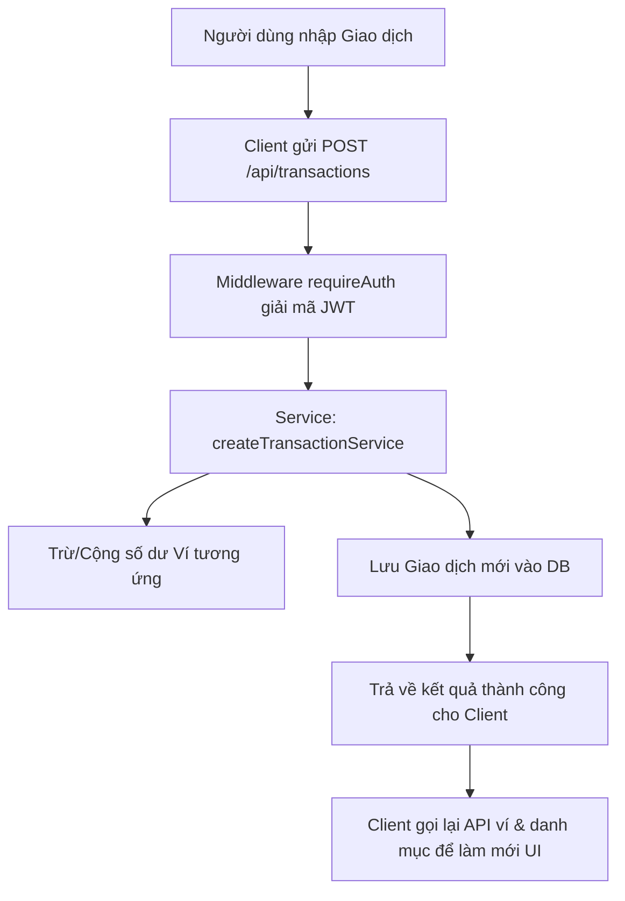

# 🌊 Thiết kế Luồng (Flow) & Kiến trúc ứng dụng SelfMoney

Tài liệu này giải thích chi tiết cách ứng dụng **SelfMoney** vận hành, luồng dữ liệu chạy giữa Client - Server - Database, và lý do đằng sau các quyết định thiết kế giao diện (UI/UX).

---

## 1. Luồng hoạt động & Luồng dữ liệu (Data & User Flow)

Ứng dụng được xây dựng trên mô hình **Client-Server** sử dụng **Next.js App Router** làm full-stack framework.

### 🔐 Luồng Xác thực (Authentication Flow)
1. **Đăng ký/Đăng nhập**: Người dùng điền thông tin qua giao diện Next.js Client Component.
2. **Backend verify**: Request gửi tới API `/api/auth/login` (hoặc `/api/auth/register`). Server mã hóa mật khẩu bằng `bcrypt`, kiểm tra tài khoản trong Database PostgreSQL và tạo mã **JWT Token** chứa thông tin người dùng.
3. **Lưu trữ Token**: Token được trả về Client và lưu trữ tại `localStorage`.
4. **Gửi Request**: Mọi API tiếp theo (ví dụ: giao dịch, ví, ngân sách) đều đính kèm Header `Authorization: Bearer <JWT_TOKEN>`.
5. **Middleware**: Đầu backend sử dụng middleware `requireAuth` để giải mã token, xác thực danh tính người dùng và gán `userId` vào luồng xử lý tiếp theo.

### 📊 Luồng Quản lý Tài chính cốt lõi (Finance Management Flow)

### 🎯 Luồng tích lũy Mục tiêu Tiết kiệm (Saving Goals Flow)
1. **Liên kết ngân sách**: Người dùng tạo Mục tiêu Tiết kiệm (Saving Goal) có thể liên kết với một Danh mục ngân sách (Category).
2. **Nạp tiền tích lũy**: Khi người dùng nhấn "Nạp tiền" từ một ví nguồn:
   - Hệ thống tự động tạo một giao dịch chi tiêu (`expense`) thuộc danh mục đặc biệt có tên `"Tiết kiệm"`.
   - Giao dịch này sẽ trừ số dư của ví nguồn đã chọn.
   - Cộng dồn số tiền nạp vào cột `saved_amount` của bảng `saving_goals`.
   - Nếu `saved_amount` đạt hoặc vượt mục tiêu `target_amount`, trạng thái mục tiêu sẽ tự động cập nhật từ `active` sang `completed`, đồng thời hiển thị **Modal chúc mừng**.
3. **Gợi ý chuyển dư (Budget Surplus)**: Hệ thống tự động quét ngân sách danh mục của tháng trước. Nếu số tiền tiêu dùng thực tế nhỏ hơn hạn mức ngân sách đặt ra, hệ thống sẽ hiển thị Banner gợi ý chuyển số tiền thừa này vào mục tiêu tích lũy có liên kết.

---

## 2. Các tính năng Thiết kế & Giải pháp kỹ thuật (Why & How)

Tại sao ứng dụng lại có các tính năng này và chúng được hiện thực hóa như thế nào?

### 📁 Sidebar thu gọn (Collapsible Sidebar)
* **Vì sao cần?**
  - Giúp tối ưu hóa không gian hiển thị thông tin chính (đặc biệt khi hiển thị bảng dữ liệu hoặc biểu đồ phân tích). Khi thu gọn, menu chỉ hiển thị icon giúp giao diện thanh lịch và rộng rãi hơn.
* **Cách hoạt động**:
  - Trạng thái thu gọn (`isCollapsed`) được lưu trữ tại một store ngoài ([SidebarStore.ts](file:///d:/Demo_money/components/SidebarStore.ts)) để tránh re-render không cần thiết.
  - Sử dụng React hook `useSyncExternalStore` để đồng bộ hóa kích thước Sidebar và phần lề trái (`margin-left`) của `Header` và `main` nội dung trang. Việc này giúp bố cục dịch chuyển đồng bộ, mượt mà (300ms transition) mà không hề xảy ra hiện tượng lệch/giật khung hình (layout shift).

### 📱 Thiết kế tương thích (Responsive Design)
* **Vì sao cần?**
  - Người dùng có thói quen theo dõi chi tiêu trên cả điện thoại (mobile), máy tính bảng (tablet) và máy tính (desktop).
* **Cách hoạt động**:
  - Sử dụng hệ thống Grid và Flexbox linh hoạt của Tailwind CSS kết hợp với các tiền tố phản hồi (`sm:`, `md:`, `lg:`, `xl:`).
  - **Trên Mobile/Tablet**: Sidebar sẽ tự động ẩn hoặc co nhỏ hoàn toàn, thay thế bằng menu trượt ra. Các bảng dữ liệu lịch sử dài được thiết kế dạng thẻ (Card) xếp chồng dọc để tránh hiện tượng tràn ngang màn hình. Các biểu đồ Recharts tự động thay đổi kích thước nhờ component `<ResponsiveContainer>`.

### ✨ Hiệu ứng thị giác & Thẩm mỹ cao cấp (Aesthetics & Effects)
* **Glassmorphism (Thiết kế kính mờ)**:
  - Các khối chức năng (Card) đều sử dụng lớp nền bán trong suốt `bg-slate-950/40` kết hợp với hiệu ứng lọc mờ `backdrop-blur-xl` và viền xám nhẹ `border-slate-850`. Thiết kế này mang đến độ sâu trường ảnh, sang trọng và hiện đại.
* **Ambient glow blobs (Các đốm sáng chuyển động)**:
  - Ứng dụng chèn các đốm màu nền mờ (`bg-violet-500/10` và `bg-emerald-500/10`) ở các góc màn hình kèm lớp mờ cực cao (`blur-[140px]`) kết hợp với hiệu ứng hoạt họa chậm `animate-pulse-glow` giúp màn hình như đang "thở", giảm bớt cảm giác đơn điệu của giao diện tối màu.
* **Tactile hover transitions (Hiệu ứng di chuột nhạy bén)**:
  - Các nút bấm và Card khi di chuột vào đều có hiệu ứng nhấc lên nhẹ (`hover:-translate-y-1`), đổ bóng phát sáng (`drop-shadow` hoặc `shadow-[0_0_15px_...]`) và tăng nhẹ độ sáng giúp người dùng cảm nhận được tính tương tác trực quan cao.

### 🌗 Đồng bộ hóa Chế độ Sáng/Tối (Light/Dark Theme Override)
* **Cách hoạt động**:
  - Lớp `.light` được thêm trực tiếp vào thẻ `body` để chuyển chế độ.
  - Thay vì sửa thủ công từng thẻ HTML, file [globals.css](file:///d:/Demo_money/app/globals.css) định nghĩa lại các biến màu CSS gốc (`--background`, `--card-bg`, `--card-border`, v.v.). Các class Tailwind trong dự án được map trực tiếp sang các biến này qua cấu hình `@theme inline` của Tailwind v4.
  - Nhờ vậy, chỉ với một hành động chuyển đổi lớp ở body, toàn bộ màu nền, viền và chữ trên trang sẽ chuyển đổi một cách đồng bộ và giữ nguyên độ tương phản cao, dễ nhìn cho người dùng.
